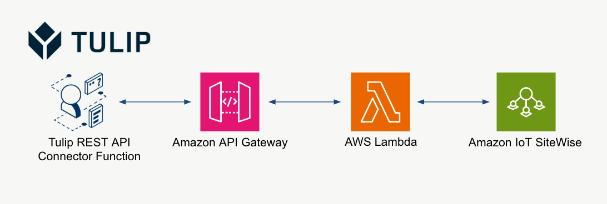

# AWS Custom REST API for IoT Sitewise Data

Because IoT Sitewise does not have a public-facing REST API, you can query data from IoT Sitewise via API Gateway and Lambda.

High-level architecture below:

# Considerations
- Secure the API Gateway with JWT, OAuth2.0, etc.
- Generalize the Lambda function to query by date range, trailing number of measurements, etc.

# Scaling
- Dealing with a large number of machines with Tulip and IoT Sitewise will require proper storage of the asset_id and property_id information; this could go into a Tulip Table; this could also be done with a separate lambda function to refrsh the Tulip table (e.g., use list_assets and list_asset_properties to refresh all information needed)
